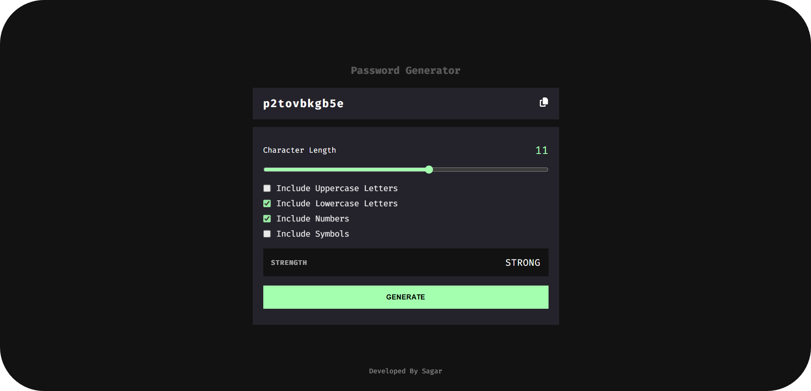

md
Copy
Edit
# 
🔐 Password Generator

A modern and responsive **Password Generator App** built using **React** and **Tailwind CSS**.  
Create strong, customizable passwords instantly — with live strength feedback and a clean UI.

---

  

---

## 🧩 Features

- Adjustable character length via slider  
- Generate passwords based on:
  - Uppercase letters  
  - Lowercase letters  
  - Numbers  
  - Symbols  
- Password **strength meter** (Weak / Moderate / Strong)  
- **Copy to clipboard** button  
- Clean, responsive, and minimal UI design.

---

## ⚙️ Tech Stack

- **React** – component-based architecture  
- **Tailwind CSS** – for clean, modern styling  
- **JavaScript** – password generation logic    
- **Vercel** – for live deployment

---

## 🚀 Demo
🔗 **Live preview:** https://password-generator-dws.vercel.app/