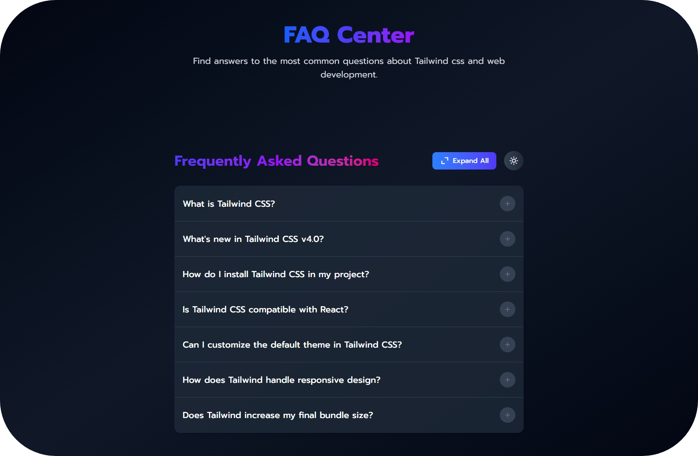

# 
FAQ Accordion 

A sleek and responsive FAQ Accordion built using **React** and **Tailwind CSS**.

---

  

---

## 🧩 Features

- Responsive design (mobile-first)
- Light & dark mode toggle
- Theme preference saved using `localStorage`
- Smooth accordion transitions

## ⚙️  Tech Stack  
- React – component architecture  
- Tailwind CSS – utility-first styling  
- CSS Variables – font customization  
- Boxicons – icon integration  
- localStorage – state persistence  
- Vite – build tool  
- Vercel – deployment   

## Demo

🔗 Live preview: https://accordiont.vercel.app/